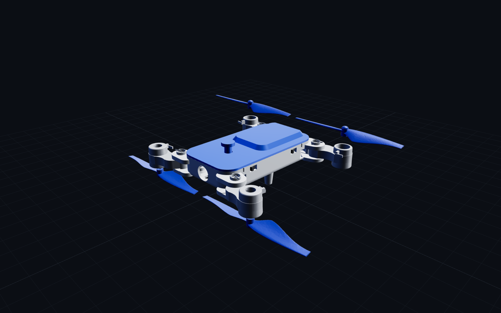

# Fr4n7-F — browser 3-D viewer (with the fold animation)



Self-contained WebGL viewer, same recipe as the Fr4n7/Fr4n6 ones: open
`drone_viewer.html` by double-click — Three.js r160 and every STL are
inlined as base64 `data:` URLs. **No CDN, no server.**

## What's special here

Each arm is its own Three.js group pivoted at its hinge, so the viewer
plays the real kinematics (FOLD_A = 79.45°, signs FR+/FL−/RR−/RL+ from
`../cad/frame_foldable.scad`):

- **« Déployer »** plays the whole V1 mechanism: the TOP button pushes
  down → the ejector latch slides back 4.5 mm and cams the nacelles out of
  their cradles → the torsion springs snap the arms open (~0.55 s) →
  button + latch spring back. **« Replier »** needs no button — the arms
  rotate in until the motor-ring cradles click, as on the real thing. A
  slider scrubs the pose; folding eases the blades into the along-arm
  transport position.
- The **torsion springs are drawn** as steel coils at the four pivots
  (arm-side legs wind with the arms). They render just above the top jaw
  — through the capot's corner notches — for readability; the real coils
  live inside the jaw pocket. Hide the capot to watch the latch work.
- `postMessage({type:'deploy'})` / `({type:'fold'})` drive it from a host
  page — the browser twin of the `deploy` SDK verb (spec in
  [`../DESIGN.md`](../DESIGN.md)). `?fold=1` opens folded.
- Front props render UNDER the belly (inverted pods) with reversed spin
  sense — the owner's no-crossing trick, visible live.

Everything else matches the other viewers: orbit + bounded zoom, per-part
toggles (châssis / capot / bras / verrou / hélices), wireframe, grid, spin
slider, `postMessage {type:'colors', body/capot/arms/mech/props}` recolour
+ `?body=…` URL params, `{type:'ready'}` handshake, `{type:'viz', visible}`
offscreen pause, and the `window.__vizRendering/__lastColors/__foldT`
test hooks.

## Mechanisms viewer (`mechanisms_viewer.html`)

A second self-contained viewer to **compare the seven printable deploy
mechanisms before printing** (`gen_mech_viewer.py`): worm+crank, scissor,
iris cam, rack+pinion, eccentric cam lever, toggle over-centre, and the
windscreen-wiper four-bar. It opens on **worm+crank, flagged ★ MÉCANISME
RETENU** — the one picked and integrated into the airframe as the V2 servo
drive (self-locking; see [`../DESIGN.md`](../DESIGN.md) §3). Each is built from its real per-part STLs
(`../cad/stl/mech/p_*.stl`) and animated with its true 2-D kinematics —
with the parts in real CONTACT (worm on the sector teeth, pinion meshed
with the rack, cam rim riding its follower). A card explains the
principle, the printability points and how it would mount on the drone.
The **« Vue drone »** button adds the folded Fr4n7-F at true scale and
syncs the stroke with the full opening (button → latch → springs → arms).
Hooks: `window.__mech`, `__t()`, `__droneOn()`, `__vizRendering()`.

## Regenerate

```bash
# 1. export the part STLs (see ../cad/README.md, incl. the 684-byte gates)
# 2. inline them + vendored Three.js into the single HTML:
python3 foldable/viz/gen_viewer.py        # -> foldable/viz/drone_viewer.html
python3 foldable/viz/gen_mech_viewer.py   # -> foldable/viz/mechanisms_viewer.html
```
