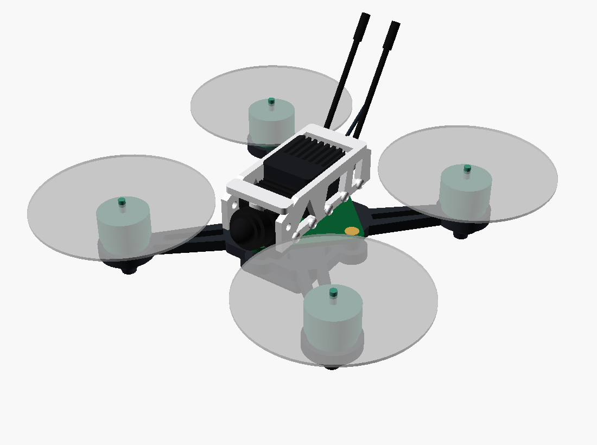

# fpv2 CAD — printable frame + canopy (v0)



`frame.scad` is the **98 mm-scale twin of `../../fpv85/cad/frame.scad`**
(same modules, same PART dispatch — keep the two in sync; only the master
parameters differ: wheelbase 98, prop 51, motor 3×M2 Ø9, pod 16, plate 3.4,
feet 8, battery 22 wide).

| PART | Print | Note |
|---|---|---|
| `frame` | 1× | unibody plate (1102 pods + whoop 25.5 AIO posts + straps + feet) |
| `canopy` | 1× | v3 EAGLE2-STYLE: two long PARALLEL RAILS (open tunnel) on the AIO stack, trussed cutouts, cam clamp at the nose, raked antenna seats at the tail |
| `prop` / `motor` | — | viewer/playground meshes (buy real ones) |
| `board/airunit/fpvcam/rxmod/battery/antennas` | — | electronics + pack + antennas — viewer meshes (buy, don't print) |

```bash
cd fpv2/cad
for P in frame canopy prop motor; do
  xvfb-run -a openscad -o stl/$P.stl --export-format binstl \
    -D "PART=\"$P\"" frame.scad; done
```
