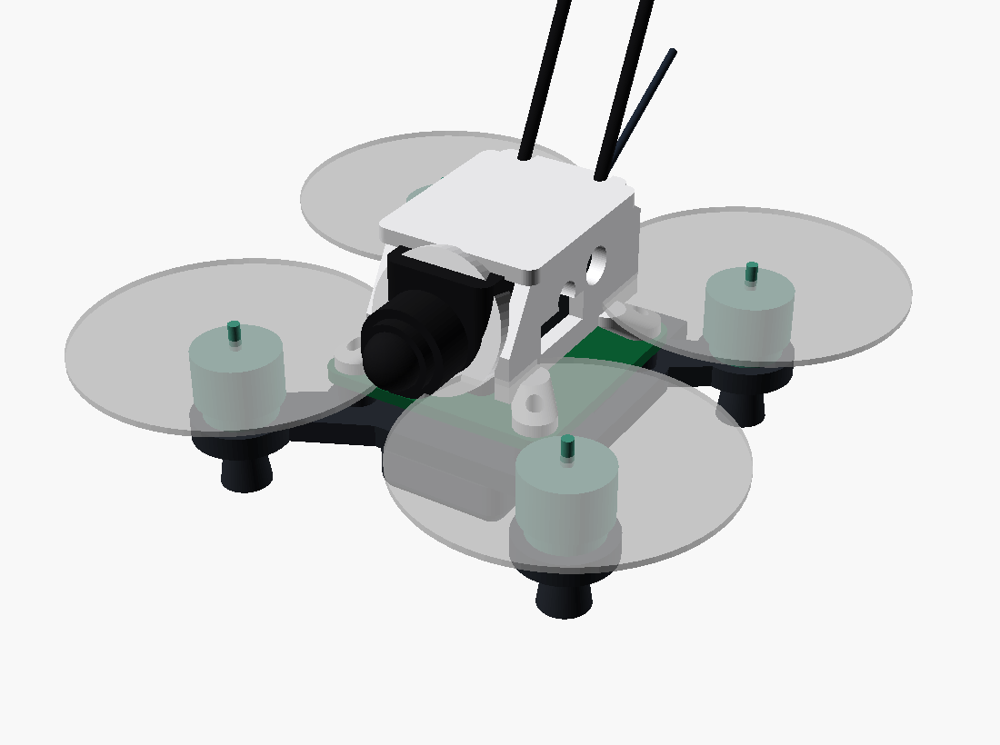

# fpv85 CAD — printable frame + canopy (v0)



One parametric file, `frame.scad`, `PART`-selected like every Stratos model.

| PART | Print | Note |
|---|---|---|
| `frame` | 1× | unibody plate: X arms → 0802 pods (3×M1.4 Ø6.6) + whoop 25.5 AIO posts + battery strap slots + feet |
| `canopy` | 1× | v1 TOOTHPICK: two side plates + top deck on the AIO stack, camera ring 15°, rear antenna clamp |
| `assembly` | — | full preview: frame + canopy + ELECTRONICS + battery + antennas + motors (ghost props) |

Key parameters (top of the file, all `TUNE` until first print): wheelbase 65,
prop 40, motor_bc 6.6, aio 25.5, cam_w 14.4, cam_tilt 15°, foot 7.

## Regenerate

```bash
cd fpv85/cad
for P in frame canopy; do
  xvfb-run -a openscad -o stl/$P.stl --export-format binstl \
    -D "PART=\"$P\"" frame.scad; done
xvfb-run -a openscad -o preview/assembly_iso.png --imgsize=1100,820 \
  --colorscheme=Tomorrow --camera=0,0,4,55,0,35,240 -D 'PART="assembly"' frame.scad
```

v0 status: dry-fit dimensions from catalogue values — the prop plane (z≈13)
clears arms/board/canopy by construction (octagonal shell inside the
prop-free centre zone), but **print & iterate before trusting any TUNE dim**.
