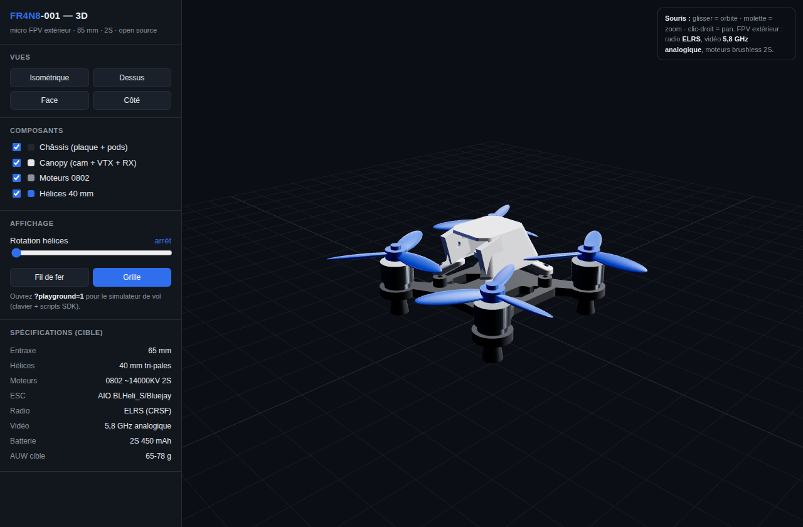

# fpv85 viewer + simulateur (navigateur)



`drone_viewer.html` — un seul fichier autonome (double-clic, hors-ligne,
Three.js r160 inliné) :

- **Vue 3D** : châssis/canopy/moteurs/hélices (les vrais STL du cad/),
  vues, toggles, fil de fer, rotation d'hélices, recolor `{type:'colors'}`.
- **`?playground=1` = le SIMULATEUR** — porté du viewer Fr4n7 : scripts SDK
  Tello (command/takeoff/go/curve/flip/…, essaim `drones N` + expressions
  en `i`), presets (hover/carré/swarm/freestyle) et **pilotage clavier**
  (T décoller, flèches translater, Z/W monter/descendre, Q/D pivoter,
  F flip, L atterrir). Cinématique SDK (1 m/s, yaw 96°/s, takeoff 0,8 m).
- Hooks : `__vizRendering`, `__pgState`, `__lastColors` ; pause hors-écran
  `{type:'viz'}` + handshake `{type:'ready'}`.

## Régénérer

```bash
# 1. exporter les STL (voir ../cad/README.md)
python3 fpv85/viz/gen_viewer.py   # -> fpv85/viz/drone_viewer.html
```
