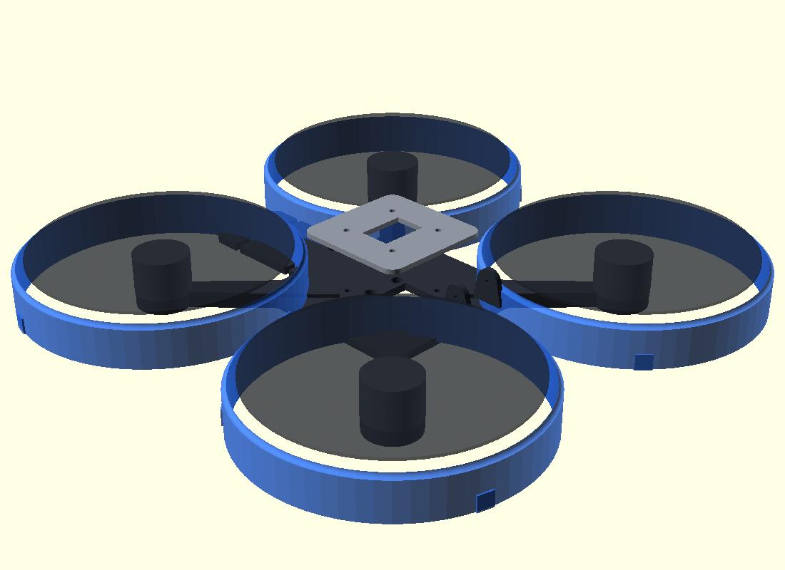

# Fr4n6-001 CAD — printable 5" frame (v0)



One parametric OpenSCAD file, three printable parts:

| Part | Export | Print |
|---|---|---|
| `frame_bottom` | `stl/frame_bottom.stl` | ×1 — PETG or PA-CF, 4 walls, 40 % gyroid, arms flat on the bed |
| `duct` | `stl/duct.stl` | ×4 — optional DEXI-style prop ducts, PETG/TPU-95, bolts to the 3 pod holes |
| `top_plate` | `stl/top_plate.stl` | ×1 — optional; or laser-cut 2 mm carbon with the same 30.5 pattern |

Key parameters (top of `frame.scad`): `wheelbase=220`, `prop_d=127` (5"),
`motor_pitch=16` (2207, M3), `stack=30.5` (FC/ESC), battery shelf
42×78 mm (4S 1500 LiPo → 6S Li-ion brick), 20×20 camera ears, downward
sensor window ahead of the shelf.

Regenerate everything:

```bash
xvfb-run -a openscad -o stl/frame_bottom.stl --export-format binstl -D 'PART="frame"' frame.scad
xvfb-run -a openscad -o stl/duct.stl         --export-format binstl -D 'PART="duct"'  frame.scad
xvfb-run -a openscad -o stl/top_plate.stl    --export-format binstl -D 'PART="top"'   frame.scad
xvfb-run -a openscad -o preview/assembly_iso.png --imgsize=1100,800 \
  --camera=430,-430,330,0,0,5 frame.scad
```

v0 status: dry-fit dimensions from datasheet values (2207 pods, 30.5
stack, 5" ducts at +4 mm tip clearance). M1 = print & iterate — expect
fillet/stiffness tuning after the first physical fit.
