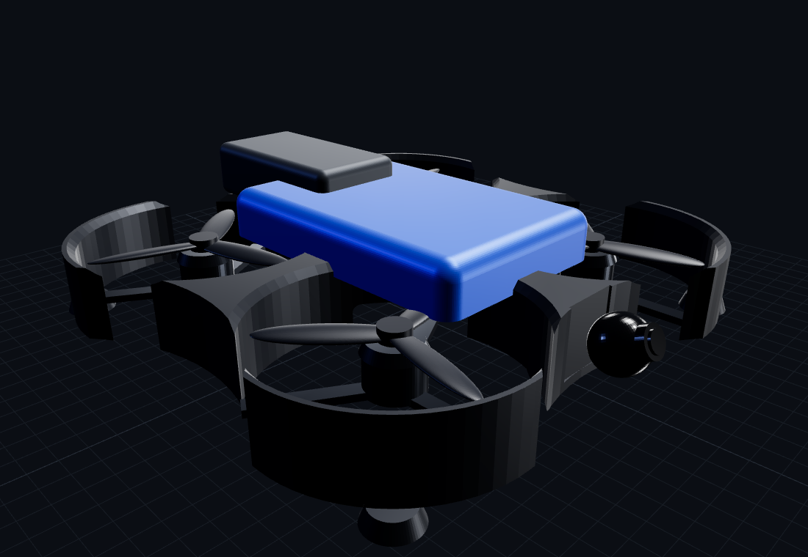

# Fr4n6-001 — browser 3-D viewer



A self-contained WebGL viewer for the Fr4n6-001, the same way the Fr4n7's
[`sim/viz/`](../../sim/viz/) works: open `drone_viewer.html` by
double-click — Three.js r160 and the six part STLs are inlined as base64
`data:` URLs, so there's **no CDN, no server, no build**.

## Design

The airframe styling follows the **DJI Avata 2** design language — a
cinewhoop where the four prop ducts are fused into one sculpted unibody
shell, a low electronics dome, a rear "backpack" battery, and a protected
camera head on the nose — reinterpreted at the Fr4n6-001's 5" / 220 mm
geometry. The geometry is our own original OpenSCAD
([`../cad/body_avata.scad`](../cad/body_avata.scad)); it is a stylistic
homage, not a copy of any DJI CAD.

## Features

- Orbit + damping, **bounded zoom**, ground grid, 4 camera presets.
- Per-part show/hide (shell / dome / battery / camera / motors / props)
  and wireframe toggle.
- Prop-spin slider.
- **Live recolour** via `postMessage({type:'colors', shell, dome, …})`
  and `?shell=…&dome=…` URL params — the *same* protocol the site
  configurator broadcasts, so a future Fr4n6 configurator drives it with
  zero glue. It also `postMessage({type:'ready'})` and honours the site's
  `{type:'viz', visible}` offscreen-pause messages.

## Regenerate

```bash
# 1. export the six part STLs from the Avata-style body
cd fr4n6/cad
for P in shell dome battery camera motors prop; do
  xvfb-run -a openscad -o stl/avata_$P.stl --export-format binstl \
    -D "PART=\"$P\"" body_avata.scad; done
# 2. inline them + vendored Three.js into the single HTML
python3 ../viz/gen_viewer.py        # -> fr4n6/viz/drone_viewer.html
```

Status: M0 styling model (matches the `cad/frame.scad` geometry). The
mechanical frame for printing lives in [`../cad/`](../cad/); this viewer is
the show/marketing model, colour-driveable like the Fr4n7 one.
