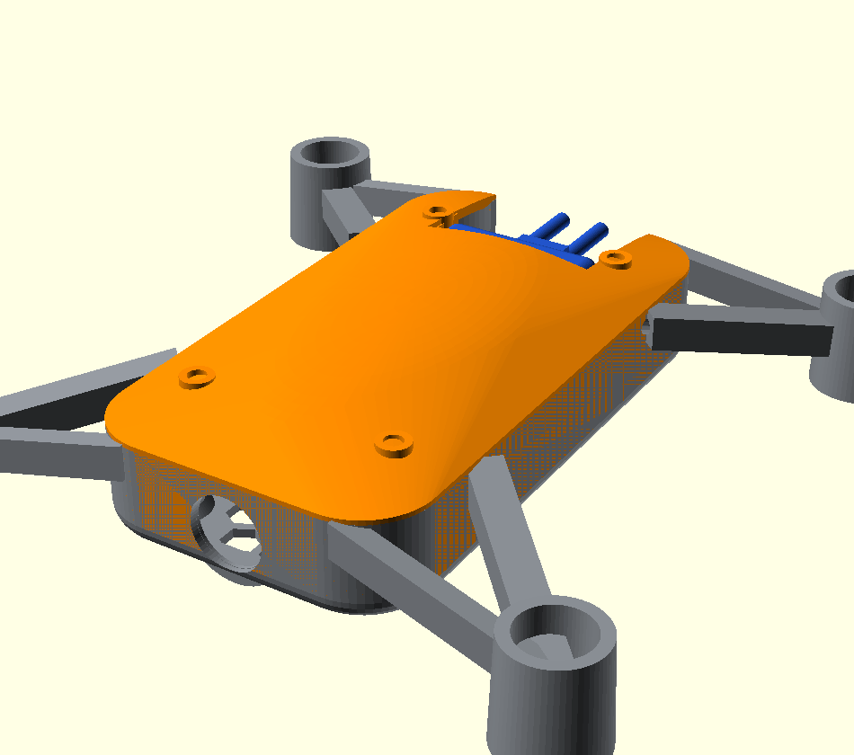
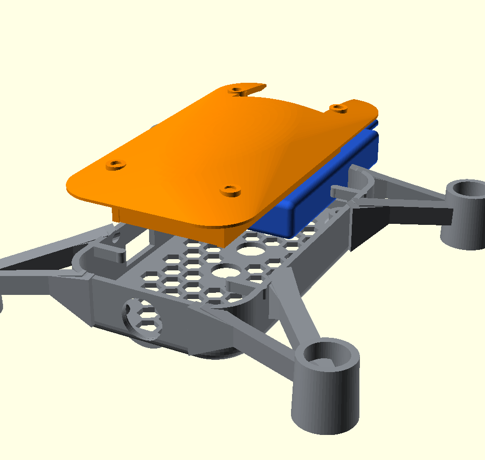

# Tello-style closed body (alternative frame)

A second airframe for the same electronics — a **closed clamshell body** in
the DJI Tello size class, as an alternative to the open `../frame.scad` X-frame.


Same flight envelope as a Tello (≈ 98 × 92.5 mm footprint, **118 mm
wheelbase**, 3" / 76 mm props, 8520 motors): smooth rounded clamshell, round
thin-wall motor mounts, **open 3-D Eiffel-truss arms** (triangulated on the top
*and* the side faces, so the lattice reads from every angle) that **slope down
from the upper body to low motor mounts** (descending dihedral, like a Tello) —
a non-flat stance with the body riding high and the props clearing above the
(lowered) canopy, plus a faceted hex-vented canopy (solid over the lens) and a
chamfered camera nose. The pod is sized to the
**real mainboard** (38 × 74 mm; M2 mounts at **26 × 62**, one in each corner_r=6
fillet with a 4.9 mm fab margin — straight from `design.py` `BOARD`); the body
also has a **rounded belly** (filleted bottom edge, less flat from the front)
and the arm roots are trimmed flush to the cavity so nothing bulges inside. The
1S pack sits on top of
the board, held by a **cradle moulded into the canopy**. The floor is a
**honeycomb vent grid** with two clean **downward apertures** for the IR ToF
(VL53L1X) and optical-flow (PMW3901) sensors; nothing mounts beneath the board.

| File | Part |
|---|---|
| `body_bottom.scad` | lower shell — PCB bay + bosses, 4 Eiffel-truss arms + motor mounts, honeycomb floor vents + ToF/flow apertures, camera nose |
| `body_bottom_v2.scad` | **alternative lower shell (Tello-look)** — **double struts per motor** (two solid tapered beams splayed from the body to each pod, a Tello-style twin arm; `arm_lattice=true` opens them into a triangular truss) + a **rear** battery slot; pairs with `body_top_v2.scad` |
| `body_top_v2.scad` | **matching capot for v2** — smooth low canopy with a **rear** battery opening + side guide rails, a front stop and retention nubs (slide the 1S pack in from the back — no need to pull the capot), 4 corner snap clips; dome stays just under the prop plane |
| `body_top.scad` | upper canopy — hex vents, LED light pipes, snap clips, battery cradle with snap retention |
| `body_top_smooth.scad` | **alternative canopy** — smooth shell, no vents/pipes (same cradle + clips); print *instead of* `body_top` |
| `body_top_dome.scad` | **alternative canopy** — fully-rounded dome (no flat top); cradle clipped to the dome so it never shows through; print *instead of* `body_top` |
| `battery_dummy.scad` | **print-fit gauge** — solid 1S pack at real size (22×53×9.5), adjust to your pack |
| `pcb_dummy.scad` | **print-fit gauge** — board outline + holes + key components, to check fit/alignment |
| `assembly.scad` | preview only (both shells + motors + prop disks) — do not print |

## Tello-look variant (v2): lattice arms + rear-loading battery

`body_bottom_v2.scad` + `body_top_v2.scad` are an alternative pair styled after
the reference Tello: a **double/twin arm** — **two solid tapered struts per
motor**, splayed from two body attach points (one on the side face, one on the
end/corner face) to the motor pod, forming a clean triangle exactly like the
Tello (set `arm_lattice=true` to open the struts into a triangular truss). The
strut tops are kept **under the body rim** (z ≤ 13). The roots sit near the corner (clear of
the camera face, which stays a clean uniform panel) and **descends** to meet the
motor pod, like a Tello — the two struts converge into the pod as one cohesive
collar (no slot cut across the roots). The motor pocket + bottom wire/vent are
cut **last**, so the bore is always clear for the 8520 to press in. The
1S pack loads from the **rear** through a slot in the lower shell and a matching
opening + guide rails in the capot, so you never have to pull the canopy to swap
a battery. **The rear slot opens only ABOVE the board top (z ≈ 5.8 mm) and the
rear wall stays solid below it**, so the pack rides **on top of the board** — it
can't slide underneath and cover the downward ToF / optical-flow sensors. The
capot guide rails likewise stop just above the board so they clear it. The capot
is a smooth low dome that stays just under the spinning props (lowered motors).




Print `body_bottom_v2.stl` + `body_top_v2.stl` as a set (light tree supports under
the down-swept blades / motor pods). Solid-volume estimate in PLA (1.24 g/cm³):
**≈ 15.5 g** lower (solid twin struts; less with `arm_lattice=true`) + **≈ 7.7 g**
capot = **≈ 23 g** — same class as the v1 pair.

## Print-fit prototype (test before the real board)

Print all four parts and dry-assemble to validate the dimensions in plastic:

1. `body_bottom.stl` + `body_top.stl` — the frame (light supports under the motor pods).
2. `pcb_dummy.stl` — drop it onto the four bosses: check the holes line up and the
   USB / camera / battery cut-outs and the floor sensor window all register.
3. `battery_dummy.stl` — clip it into the canopy cradle; it should snap and not fall
   when the canopy is flipped.

Adjust `batt_*` (in both `body_top.scad` and `battery_dummy.scad`) and any opening
that doesn't line up, then re-export and print the real frame.

```bash
openscad -o stl/body_bottom.stl --export-format binstl body_bottom.scad
openscad -o stl/body_top.scad   --export-format binstl body_top.scad
```

Print in PETG or tough PLA, 3 perimeters. The canopy still prints support-free;
the lower shell needs **light supports under the descending arms / motor pods**
(the down-swept arms overhang) — tree supports at the four motor mounts are
enough. The pod fits the **38 × 74 mm Tello-style PCB** (see
`../../pcb/`, board outline `BOARD` in `design.py`); the four M2 bosses are at
a **26 × 62 mm** pitch — one in each rounded corner (matching the board's real
holes), filleted with a screw lead-in. Press the 8520 motors into the round mounts, route the wires through
the arm channels to the board's corner motor pads, drop the board onto the four
bosses, slide the 1S pack into the canopy cradle, and snap the canopy on.

## Printed mass

Lightweight revision — round thin-wall motor mounts (was solid hex blocks),
**open 3-D Eiffel-truss arms** (triangulated on top + sides), rounder pod, thinner
walls/floor, and a clean canopy (no cosmetic arm caps, solid over the lens) with
an integrated battery cradle. Solid-volume estimate in PLA (1.24 g/cm³); the real
print, mostly thin walls, lands close to this:

| Shell | Volume | ~Mass (PLA) |
|---|---|---|
| `body_bottom` | 12.3 cm³ | **15.3 g** |
| `body_top` | 5.7 cm³ | **7.1 g** (incl. battery cradle) |
| **Frame total** | 18.0 cm³ | **≈ 22.3 g** |

Down from ≈ 39 g (the original hex-block shells) — ~35 % lighter, *and* it now
fits the real 38 × 74 board (the old 37 mm inner pod could not) and retains the
battery. With the ~92 g electronics + battery + motors the all-up weight stays
Tello-class (≈ 90 g, 95 g cap). For the open racing-style frame use the parts in
the parent directory instead.
