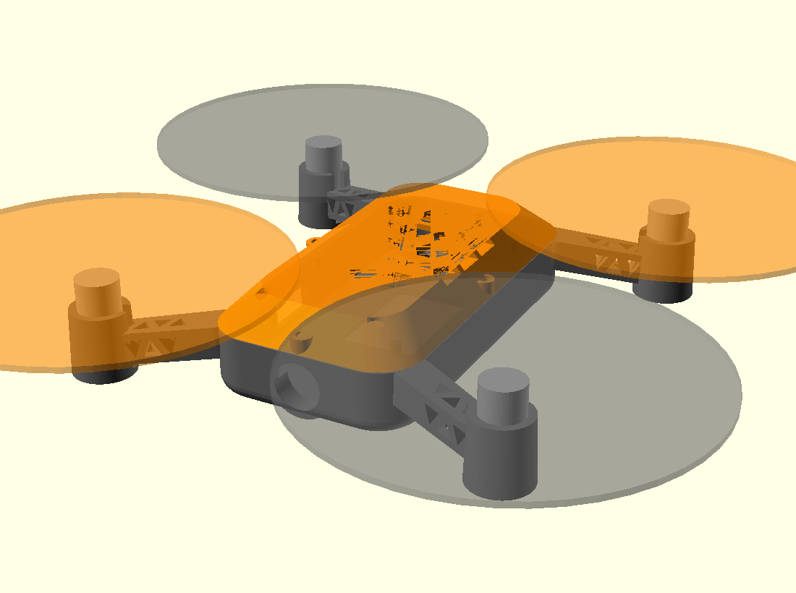

# Tello-style closed body (alternative frame)

A second airframe for the same electronics — a **closed clamshell body** in
the DJI Tello size class, as an alternative to the open `../frame.scad` X-frame.



Same flight envelope as a Tello (≈ 98 × 92.5 mm footprint, **118 mm
wheelbase**, 3" / 76 mm props, 8520 motors): smooth rounded clamshell, round
thin-wall motor mounts, **open 3-D Eiffel-truss arms** (triangulated on the top
*and* the side faces, so the lattice reads from every angle) that **slope down
from the upper body to low motor mounts** (descending dihedral, like a Tello) —
a non-flat stance with the body riding high and the props clearing above the
(lowered) canopy, plus a faceted hex-vented canopy (solid over the lens) and a
chamfered camera nose. The pod is sized to the
**real mainboard** (38 × 74 mm; M2 mounts at **26 × 62**, one in each corner_r=6
fillet with a 4.9 mm fab margin — straight from `design.py` `BOARD`); the body
also has a **rounded belly** (filleted bottom edge, less flat from the front)
and the arm roots are trimmed flush to the cavity so nothing bulges inside. The
1S pack sits on top of
the board, held by a **cradle moulded into the canopy** (bottom-side flow + ToF
sensors look down through the floor window, so nothing mounts beneath the board).

| File | Part |
|---|---|
| `body_bottom.scad` | lower shell — PCB bay + bosses, 4 Eiffel-truss arms + motor mounts, bottom sensor window, camera nose |
| `body_top.scad` | upper canopy — hex vents, LED light pipes, snap clips, integrated battery cradle |
| `assembly.scad` | preview only (both shells + motors + prop disks) — do not print |

```bash
openscad -o stl/body_bottom.stl --export-format binstl body_bottom.scad
openscad -o stl/body_top.scad   --export-format binstl body_top.scad
```

Print in PETG or tough PLA, 3 perimeters. The canopy still prints support-free;
the lower shell needs **light supports under the descending arms / motor pods**
(the down-swept arms overhang) — tree supports at the four motor mounts are
enough. The pod fits the **38 × 74 mm Tello-style PCB** (see
`../../pcb/`, board outline `BOARD` in `design.py`); the four M2 bosses are at
a **26 × 62 mm** pitch — one in each rounded corner (matching the board's real
holes), filleted with a screw lead-in. Press the 8520 motors into the round mounts, route the wires through
the arm channels to the board's corner motor pads, drop the board onto the four
bosses, slide the 1S pack into the canopy cradle, and snap the canopy on.

## Printed mass

Lightweight revision — round thin-wall motor mounts (was solid hex blocks),
**open 3-D Eiffel-truss arms** (triangulated on top + sides), rounder pod, thinner
walls/floor, and a clean canopy (no cosmetic arm caps, solid over the lens) with
an integrated battery cradle. Solid-volume estimate in PLA (1.24 g/cm³); the real
print, mostly thin walls, lands close to this:

| Shell | Volume | ~Mass (PLA) |
|---|---|---|
| `body_bottom` | 13.5 cm³ | **16.7 g** |
| `body_top` | 4.8 cm³ | **6.0 g** (incl. battery cradle) |
| **Frame total** | 18.3 cm³ | **≈ 22.6 g** |

Down from ≈ 39 g (the original hex-block shells) — ~35 % lighter, *and* it now
fits the real 38 × 74 board (the old 37 mm inner pod could not) and retains the
battery. With the ~92 g electronics + battery + motors the all-up weight stays
Tello-class (≈ 90 g, 95 g cap). For the open racing-style frame use the parts in
the parent directory instead.
