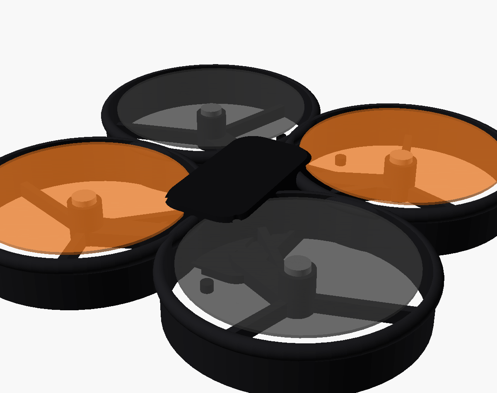

# STRATOSDRONE — whoop airframe (primary frame)

The main printable airframe: a clean, swept "whoop" body with a **removable
Tello-style canopy** and a **rear slide-in 1S battery**, around the unchanged
electronics (compact 36×70 mainboard, brushed 8520 motors, 3" props,
**118 mm wheelbase**).



## One parameter, three protection levels

Set `guard` in `params.scad` (or override on the CLI with `-D`):

| `guard` | look | use |
|---|---|---|
| `"none"` | bare swept arms, no guard — lightest, most minimal | open flying, max efficiency |
| `"ring"` | thin open prop-guard rings on struts (Tello-style) | light protection |
| `"duct"` | full cinewhoop ducts with rounded intake lips + skids | reinforced, indoor/contact |

```bash
for g in none ring duct; do
  openscad -D guard=\"$g\" -o stl/frame_$g.stl --export-format binstl frame.scad
done
openscad -o stl/canopy.stl --export-format binstl canopy.scad
```

## Files

| File | Part |
|---|---|
| `params.scad` | shared dimensions + `guard` variant + helper modules |
| `frame.scad` | deck (PCB bay + rear battery cradle + canopy sockets), swept arms, 8520 motor pockets, prop guards |
| `canopy.scad` | removable smooth canopy — camera nose, side air intakes, LED pipes, snap clips |
| `assembly.scad` | preview only (frame + canopy + motors + props) — do not print |

## Design intent

Smooth, swept, aggressive, airflow-optimised — the canopy crown is biased
forward, the arms taper into the motor nacelles, and the duct variant uses a
rounded intake lip. The canopy **clips on/off without screws** (posts mate with
the deck sockets) so the shell can be swapped/customised like a Tello.

## Print & assemble

PETG or tough PLA, 3 perimeters on the frame, 2 on the canopy, no supports
(each part prints flat on its open face). Press the 8520 motors into the arm
pockets, mount the 36×70 board on the M2 bosses (26×60 pitch), route motor
wires along the arms, slide the 1S pack into the rear bay, clip the canopy on.

Overall span ≈ 160–170 mm with the 3" props (the concept's 140 mm figure was
for 2" props; we kept the validated 3"/8520/118 mm electronics). Target
all-up weight ≈ 95–105 g depending on the guard variant.

The earlier `../tello_style/` clamshell and `../frame.scad` X-frame remain in
the repo as alternatives.
