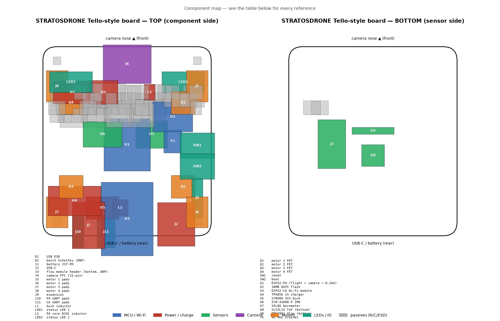

# STRATOSDRONE PCB

A 4-layer, **48×54 mm Tello-style portrait** controller board for the
STRATOSDRONE: chip-down ESP32-P4 (flight + camera + hardware H.264) with an
ESP32-C6-MINI-1 Wi-Fi co-processor, IMU / barometer / ToF / optical-flow
sensors, a MIPI-CSI camera FFC at the nose, 1S USB-C charging at the rear, and
four corner brushed-motor drivers. It drops into the printed body pod
(`../frame/tello_style/`).

**Lost among the parts?** See the annotated component map (`make map`):



> **Read [`KNOWN_GAPS.md`](KNOWN_GAPS.md) before ordering.** This design is
> generated as a reviewable starting point: the netlist, BOM and placement are
> complete and self-consistent, but signal routing and several datasheet-level
> verifications must be finished by hand in KiCad first.

## Design as code

The board is generated from one source of truth, `scripts/design.py`
(components, LCSC parts, pin-level nets, placement). Regenerate everything:

```bash
make            # board + pinmap + fab + consistency check
make board      # stratosdrone.kicad_pcb from design.py
make pinmap     # firmware/components/board/include/board_pinmap.h
make fab        # jlcpcb/bom.csv, cpl.csv, gerbers/ (preliminary)
make check      # assert board nets + firmware pinmap match design.py
make preview    # preview/top.svg, bottom.svg
```

Requires KiCad 7 (`pcbnew` Python module + `kicad-cli`). The vendored
Espressif P4/C6 symbols and footprints in `lib/` were downgraded to the
KiCad 7 file format; `lib/strat.pretty/` holds project-specific footprints.

## Files

```
stratosdrone.kicad_pcb   generated board (open in KiCad to route)
scripts/design.py        ← edit this; the authoritative netlist + BOM
scripts/gen_pcb.py       design.py -> .kicad_pcb (place, net, pour)
scripts/gen_pinmap.py    design.py -> firmware board_pinmap.h
scripts/export_fab.py    -> jlcpcb/{bom.csv,cpl.csv,gerbers/}
scripts/check_consistency.py  CI gate: board == design == firmware pinmap
lib/                     vendored Espressif + project footprints/symbols
jlcpcb/                  fabrication outputs (BOM/CPL real; gerbers preliminary)
```

## Ordering at JLCPCB (after routing + review)

1. Finish routing in KiCad, fill zones (**B**), run **DRC** to zero errors.
2. Re-export gerbers/drill from KiCad (Plot) — *not* from `export_fab.py`,
   which exports the unrouted board.
3. PCB options: **4-layer**, 1.6 mm, JLC04161H-7628 stackup (controlled
   impedance for the USB/CSI pairs), 0.5 oz outer / 0.5 oz inner, ENIG finish
   (recommended for the fine-pitch QFN and FFC pads).
4. Assembly: **PCBA**, both sides (top: MCU/power/most parts; bottom: the two
   downward sensors). Upload `jlcpcb/bom.csv` and `jlcpcb/cpl.csv`; they use
   the JLC column format and the LCSC part numbers from `design.py`.
5. Confirm every **VERIFY** item in `KNOWN_GAPS.md` is closed.

## Approx. cost (qty 5, indicative — get a live quote)

| | per board |
|---|---|
| 4-layer PCB + PCBA (qty 5, both sides) | ~$18–28 |
| ICM-42688-P (the expensive line) | ~$10.5 |
| ESP32-P4 + C6 module + flash | ~$9 |
| sensors (baro, ToF, flow) + camera module | ~$11 |
| passives, connectors, FETs, USB-C, regulators | ~$6 |
| **board total** | **~$55–65** |
| + motors (×4), 1S 1100 mAh pack, props, frame filament | ~$25 |

Estimate only — not a quote, and excludes the verification rework above.
