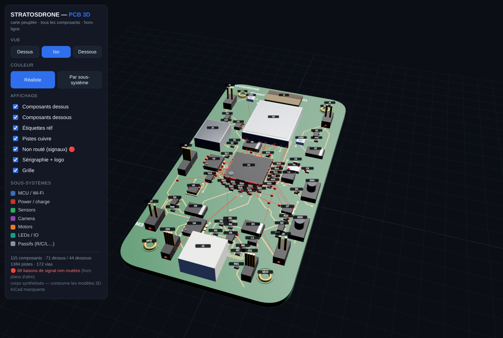

# PCB 3-D viewer — carte peuplée, dans le navigateur



`pcb3d_viewer.html` : un **seul fichier HTML autonome** (ouvre par double-clic,
aucun serveur, aucun CDN) qui montre la carte STRATOSDRONE **peuplée en 3D avec
ses 115 composants** — dessus, dessous, pistes cuivre, sérigraphie et logo.

## Pourquoi cet outil

Sur cette machine il n'y a ni `kicad-cli`, ni `pcbnew`, ni les **modèles 3D**
des composants (les 108 références `${KICAD9_3DMODEL_DIR}` de la carte ne
résolvent vers aucun fichier ; 6 empreintes n'ont de toute façon aucun modèle :
U1 ESP32-P4, U9 PMW3901, MH1-4). Impossible donc d'exporter un STEP/glTF ou
d'ouvrir la vue 3D de KiCad.

Cet outil **contourne le problème** : il **synthétise un corps 3D propre pour
CHAQUE composant** à partir de primitives Three.js, d'après une table
d'archétypes indexée sur le nom d'empreinte. Comme on fabrique chaque pièce
nous-mêmes, la notion de « modèle manquant » disparaît — la carte est toujours
100 % peuplée.

## Ce qu'on voit

- **Carte** 38 × 74 mm (coins r6), FR4 vert, 4 trous M2 cerclés d'or.
- **115 composants** (71 dessus / 44 dessous) : ICs & modules (U1 QFN, U3 blindage
  RF, U2/U4…), passifs R/C/L, connecteurs (USB-C, JST batterie, FFC caméra,
  headers à broches dorées), MOSFET moteurs, LEDs, boutons, quartz, diodes, trous.
- **Pistes cuivre** (1384) + **vias** (172) cuites dans la texture du masque, par
  couche — on voit l'avancement du routage.
- **Sérigraphie** (STRATOSDRONE, FRONT^, CAM/RF/CPU, M1-M4, FLOW+ToF) + le **logo
  hélice** sur le dos.
- **Liaisons non routées en ROUGE** (le « chevelu ») : les nets de **SIGNAL** dont
  les pads ne sont pas encore reliés par du cuivre — exactement ce qui reste à
  router à la main. Calculé sans KiCad par **reconstruction de connectivité**
  (union-find couche par couche sur pistes + vias + pads). Les **plans d'alim**
  (GND/3V3/VBAT/VDD*) sont exclus (remplis par des zones). Toggle dédié + compteur
  (~68 liaisons — la liste recoupe la section signaux de `../KNOWN_GAPS.md`).
- **Étiquettes** de référence flottantes, **survol** = réf + valeur + rôle +
  sous-système, deux modes couleur (**réaliste** ↔ **par sous-système**), vues
  Dessus / Iso / **Dessous** (la carte se retourne physiquement), et les bascules
  d'affichage.

## Régénérer

```bash
python3 hardware/pcb/viz/gen_pcb3d.py     # -> hardware/pcb/viz/pcb3d_viewer.html
```

Le générateur lit :
- `../stratosdrone.kicad_pcb` — positions `(at x y rot)`, couche, boîte `*.Fab`,
  pistes `(segment …)`, vias, sérigraphie `(gr_text …)` (parsing texte, pas de pcbnew) ;
- `../scripts/design.py` — `all_components()` (valeur, côté, rôle) + `BOARD` ;
- les couleurs de sous-système + descriptions (copiées de `../scripts/gen_component_map.py`)
  et la géométrie du logo (`../scripts/add_logo.py`).

Trois.js r160 est inliné depuis `sim/viz/vendor` (même recette que les autres
visualisateurs). Les étiquettes sont des `Sprite` texturés (seul chemin de texte
100 % hors-ligne).

## Table d'archétypes

`classify()` (dans `gen_pcb3d.py`) mappe le nom d'empreinte → forme + hauteur +
matériau : `chip` (R/C/L), `soic`, `qfn` (dont ESP32-P4), `sot`, `module` (blindage
C6), `can` (quartz), `usbc`, `ffc`, `conn` (JST), `header` (base + broches), `led`,
`button`, `diode`, `hole`, et un `box` de repli. La taille du corps vient de la
boîte `F.Fab`/`B.Fab` réelle de l'empreinte (repli par archétype si absente).

## Vérifier

```bash
node hardware/pcb/viz/verify_pcb3d.cjs    # Playwright headless (swiftshader)
```
Contrôle : rendu actif, `__pcbInfo()` = 115 pièces (71 + 44), 0 erreur console,
captures dessus / dessous / sous-système.

## Limites (M0)

Corps **synthétiques** (formes réalistes, pas les modèles fab exacts) — le but est
de **voir la carte peuplée**, pas un rendu mécanique certifié. Pistes projetées sur
la surface (pas les 4 couches empilées physiquement ; In1/In2 estompées). Le
parseur cible le format `20221018` du fichier courant.
