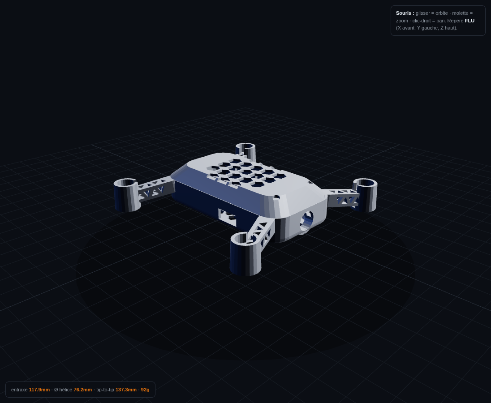

<!-- SPDX-License-Identifier: MIT -->
# STRATOSDRONE — visualisateur 3D

Un visualisateur 3D interactif du drone, **ancré sur le modèle de simulation**
(`sim/models/stratosdrone/model.sdf`). Le générateur lit les contraintes dures du
SDF (positions moteurs, rayon hélice, entraxe, masse) ; éditez le SDF, régénérez,
la vue 3D suit.

Trois rendus, commutables en direct :

- **Frame imprimé** *(par défaut)* — le **vrai frame `tello_style`** (les deux
  coques assemblées) embarqué depuis `frame.stl`, pour voir la pièce réelle à
  imprimer en 3D interactif. 
- **Stylisé (Tello)** — un corps moderne *classe DJI Tello* construit
  procéduralement (coque arrondie, canopy ventilée, nez caméra, bras balayés,
  hélices 2 pales profilées, **anneaux protège-hélices**) avec matériaux PBR et
  éclairage par image (reflets). Posé sur la vraie géométrie moteurs/hélices.
- **Sim (SDF brut)** — les primitives de collision/visuel exactes de Gazebo,
  pour vérifier que le modèle stylisé colle toujours au modèle simulé.

> `frame.stl` est un assemblage basse résolution généré depuis
> `hardware/frame/tello_style/frame_assembled.scad` (`openscad -D '$fn=24'`),
> copié ici et inliné en base64 par `gen_viewer.py`. Régénérez-le après une
> retouche du frame.

Sert à **valider ou repenser** la géométrie sans ouvrir KiCad/OpenSCAD/Gazebo :
implantation des moteurs, encombrement des hélices/anneaux, empilage vertical,
et — par glisser-déposer des STL — l'ajustement du frame imprimé sur l'électronique.

## Ouvrir

`sim/viz/drone_viewer.html` est **un seul fichier autonome** (Three.js inliné en
base64, aucun CDN, aucun serveur). Double-cliquez-le — il s'ouvre dans n'importe
quel navigateur récent, **hors-ligne**.

> Le rendu utilise les modules ES depuis des URL `data:`, ce qui contourne le
> blocage CORS habituel des `file://`. Pas besoin de lancer un serveur web.

## Régénérer (après avoir édité le modèle)

```bash
python3 sim/viz/gen_viewer.py          # relit le SDF -> réécrit drone_viewer.html
python3 sim/viz/gen_viewer.py --open   # affiche aussi une URL file:// à ouvrir
```

Boucle « temps réel » : éditez `model.sdf`, relancez la commande, rafraîchissez
l'onglet du navigateur. Les dimensions affichées (entraxe, Ø hélice, envergure,
encombrement, masse) sont **recalculées depuis la géométrie** à chaque génération.

## Contrôles

| Zone | Action |
|------|--------|
| **Modèle** | bascule **Stylisé (Tello)** ↔ **Sim (SDF brut)** |
| **Vues** | Isométrique / Dessus / Face / Côté |
| **Composants** | masquer/afficher corps, bras, moteurs, hélices, carénages |
| **Vue éclatée** | écarte radialement + verticalement pour inspecter l'empilage |
| **Rotation hélices** | anime les 4 hélices (sens CW/CCW comme un vrai quad) |
| **Fil de fer / Grille / Axes / Coque collision** | repères et debug |
| **Frame imprimé (STL)** | glissez un `.stl` depuis `hardware/frame/**/stl/` pour le superposer (échelle mm→m auto), curseur d'opacité |
| Souris | glisser = orbite · molette = zoom · clic-droit = pan |

Le drone est orienté **FLU** (X avant, Y gauche, Z haut), identique au repère du SDF.

## Fichiers

| Fichier | Rôle |
|---------|------|
| `gen_viewer.py` | générateur : parse le SDF + inline Three.js → HTML |
| `drone_viewer.html` | **le visualisateur** (artefact généré, auto-suffisant) |
| `vendor/` | source Three.js r160 épinglée (lue par le générateur ; inlinée dans le HTML) |

> Three.js est volontairement présent à deux endroits : `vendor/` est la source
> auditable/épinglée pour régénérer, et une copie inlinée vit dans le HTML pour
> qu'il s'ouvre par double-clic sans réseau. Régénérez toujours via `gen_viewer.py`.
